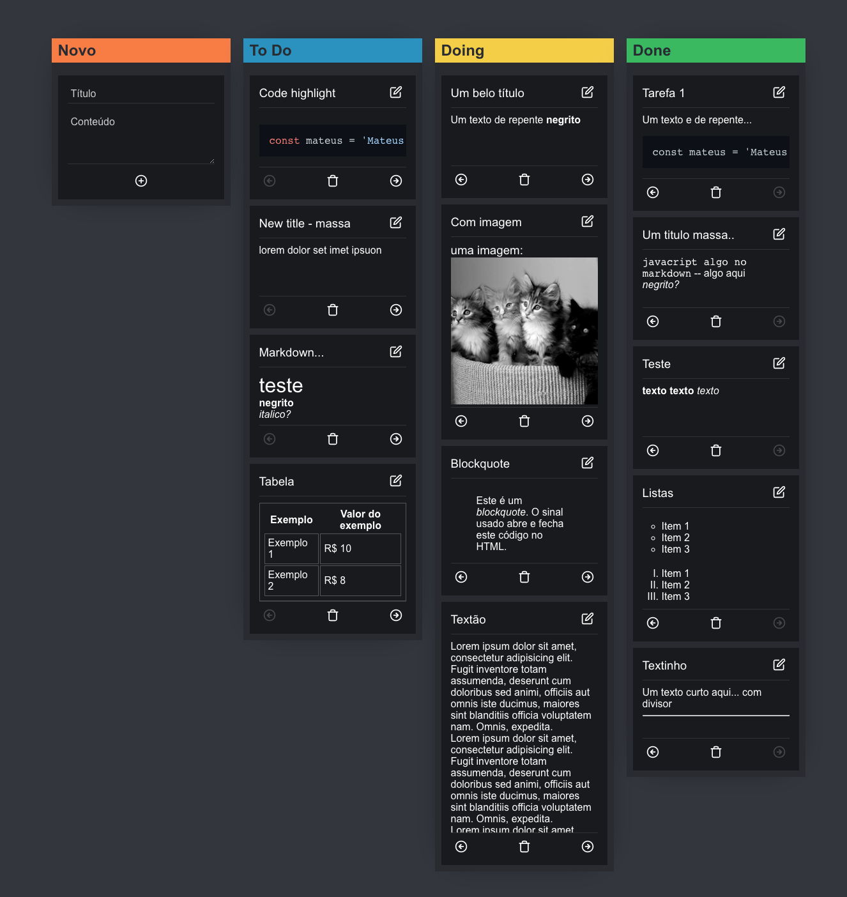

# Kanban Board

  

Este projeto foi realizado como desafio técnico frontend para a [Ada](https://ada.tech/) (Let's Code), e foi iniciado a partir do [Vite](https://vitejs.dev).

  



  

## O que encontrará nesse README

  

- [Rodando o projeto](#run-project)

- [Scripts disponíveis](#scritps)

- [Links úteis](#links-uteis)

- [Agradecimento](#agradecimento)

  <a  id="run-project"></a>

## Rodando o projeto

Após <a target="_blank" href="https://docs.github.com/pt/repositories/creating-and-managing-repositories/cloning-a-repository">clonar</a> o projeto execute primeiro o back-end: (Foi necessário mudar a porta para 3333)

```bash
>  cd BACK
>  npm install
>  npm run server
```
Depois abra outra janela do terminal e execute o front-end:

```bash
>  cd ../FRONT
>  npm install
>  npm run dev
```
Deverá aparecer o projeto rodando assim como a porta, abra no navegador para visualizar o projeto rodando com todas as suas fetures (exemplo: http://127.0.0.1:5173)

<a  id="scritps"></a>

## Scripts disponíveis

  

No projeto você pode rodar a partir do terminal os seguintes comandos

  

### `npm run dev`

  

Para rodar a aplicação em modo de desenvolvimento (lembre-se de instalar as dependência na raiz do projeto com o comando `npm install` )

  

Abra [http://127.0.0.1:5173/](http://127.0.0.1:5173/) (porta pode mudar acesse a apresentada no terminal), para visualizar no seu navegador, a página irá atualizar automaticamente após salvar os arquivos, e todos os erros serão apresentados em tela caso houver

  

### `npm run test`

  

Para rodar todos os testes em watch mode.

  

### `npm run coverage`

  

Para rodar todos os testes e gerar o coverage report.

  

### `npm run build`

  

Para buildar a aplicação para modo de produção, realizando todas as minificações para uma melhor performance e gerando o bundle completo da aplicação. Após esse comando sua aplicação estará pronta para o deploy na pasta `dist/` para maiores informações ver sessão [deployment](https://vitejs.dev/guide/static-deploy.html#deploying-a-static-site) na documentação oficial do Vite.

### `npm run preview`

Para rodar a aplicação em modo preview/produção, lembre que não haverá hot reload e as alterações não serão refletidas nessa página. Caso queira atualizar e visualizar as alterações pare o preview, execute `npm run build` novamente rode `npm run preview`. 

<a  id="links-uteis"></a>

## Links uteis

  

- [Repo GitLab](https://gitlab.com/gabriel.militello1/desafio-tecnico-frontend) Enunciado do desafio proposto para esse projeto.

- [TODO.md](https://github.com/MateusPaixao/desafio-tecnico-ada/blob/master/FRONT/TODO.md) utilizado para gerenciar os passos para finalização desse projeto e adicionado possíveis melhorias.

- [Stack Edit](https://stackedit.io/) Utilizado para editar esse Readme


<a  id="agradecimento"></a>

## Agradecimento

  
Agradeço a oportunidade de realizar o desafio, espero que tenha ficado dentro do esperado, dei o melhor no período que foi estabelecido. Obrigado! =D